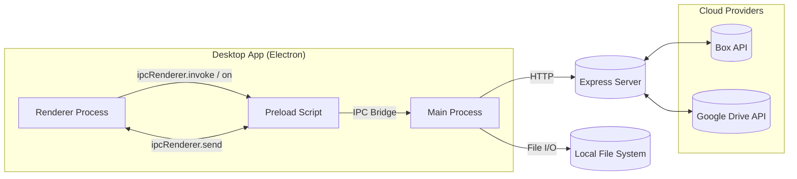
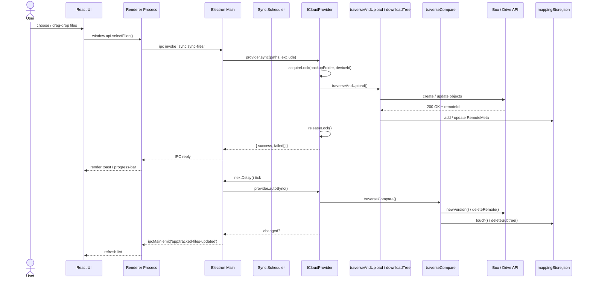
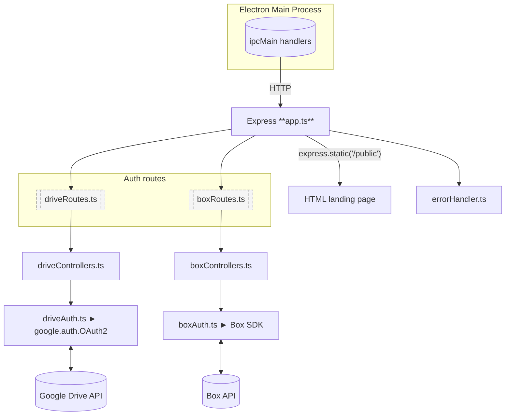

# File Synchronizer – Architecture & Flow

This document explains how the cross‑platform **File Synchronizer** application works and how its pieces fit together. It can be shared with new contributors or stakeholders who need a quick but complete technical overview.

---

## 1  High‑Level Architecture

### Key ideas

- **Single binary**: Electron bundles the React front‑end and Node back‑end, so the user installs one desktop app.
- **Security**: The preload layer exposes a **whitelisted API**; the renderer never gets Node internals directly.
- **Separation of concerns**: Cloud logic lives in `src/main/providers`, while OAuth & token refresh live in the embedded Express server (`src/server`).

---

## 2  Folder Structure Cheatsheet

| Path                 | Purpose                                                                              |
| -------------------- | ------------------------------------------------------------------------------------ |
| `src/main/bootstrap` | Boot sequence (create windows, schedule sync, auto‑update).                          |
| `src/main/handlers`  | IPC request handlers (auth, selection, settings, sync, tracked files).               |
| `src/main/providers` | Implementation for each cloud vendor (`Box.Provider.ts`, `GoogleDrive.Provider.ts`). |
| `src/main/utils`     | Generic algorithms (traverse & compare, upload, download, symlink, etc.).            |
| `src/main/windows`   | Window/tray creation helpers.                                                        |
| `src/preload`        | Secure bridge between renderer and main.                                             |
| `src/renderer/src`   | React UI (components, hooks, types).                                                 |
| `src/server`         | Stand‑alone Express API used for OAuth redirects & REST proxy.                       |

---

## 3  Synchronization Workflow

### Highlights

- **Lock file (`__ticklabfs_sync.lock`)** ensures that only one device writes to the provider’s backup folder at a time.
- **mappingStore** keeps the authoritative map `{localPath → {id, isDirectory, provider, account, lastSync}}` and is flushed to `config.json` after every change .
- **Scheduler** runs every 5 min ± 30 s jitter (`BASE_INTERVAL`, `JITTER_RANGE`) ; it skips the cycle if no accounts or no central folder are configured.

---

## 4  Auto‑Update Flow

1. `src/main/bootstrap/updater.ts` checks GitHub releases.
2. If a new version exists, it downloads the signed package to a temp dir.
3. The user is prompted via an in‑app dialog; on confirmation the app quits and relaunches the installer.

---

## 5 Back‑End (Embedded Express)

**Design principle**: The embedded Express app acts solely as an **OAuth gateway and thin REST proxy**. All heavy lifting—syncing, uploads, downloads—lives in the Electron main process, keeping the server footprint tiny and avoiding any additional background service for the user.

---

## 6 Data Storage

| Storage artefact                          | On-disk (Windows) path\*                                                          | What’s inside                                                                                                                                                                                                          |
| ----------------------------------------- | --------------------------------------------------------------------------------- | ---------------------------------------------------------------------------------------------------------------------------------------------------------------------------------------------------------------------- |
| **Electron-store config** (`config.json`) | `%APPDATA%/file-synchronizer/config.json`                                         | `deviceId`, `settings` (darkMode, stopSyncPaths, resumeSyncPaths), `mappings` (path → RemoteMeta), active-account flags (`gdActive`, `boxActive`), cached account lists (`gdAccounts`, `boxAccounts`), `pendingUpdate` |
| **Central config**                        | `%APPDATA%/file-synchronizer/central-config.json`                                 | `{ "centralFolderPath": ".../__ticklabfs_central" }` – created once at first run                                                                                                                                       |
| **Central workspace folder**              | `%APPDATA%/file-synchronizer/__ticklabfs_central/`                                | Real files pulled from the cloud **plus** symlinks pointing back to original locations                                                                                                                                 |
| **Secure credentials**                    | OS keychain entry `com.filesynchronizer.googledrive` / `com.filesynchronizer.box` | Per-account OAuth tokens (JSON blob)                                                                                                                                                                                   |
| **Remote backup folder**                  | `__ticklabfs_backup` in each provider’s root                                      | Mirrored file-tree, metadata (`originalPath`, `os`) and the lock file `__ticklabfs_sync.lock`                                                                                                                          |

`%APPDATA%` is automatically resolved from `app.getPath('userData')`; on macOS it is `~/Library/Application Support`, on Linux `${XDG_CONFIG_HOME}`.

---

## 7  Extensibility Guidelines

1. **Add a provider**: create `src/main/providers/MyCloud.Provider.ts` implementing `ICloudProvider` and register it in `src/main/bootstrap/provider.ts`.
2. **Add a new IPC route**: write a handler in `src/main/handlers` and expose it in `src/ipc/ipcHandlers.ts` + preload.
3. **Add a new UI panel**: create component under `src/renderer/src/components` and wire it to Zustand store.
